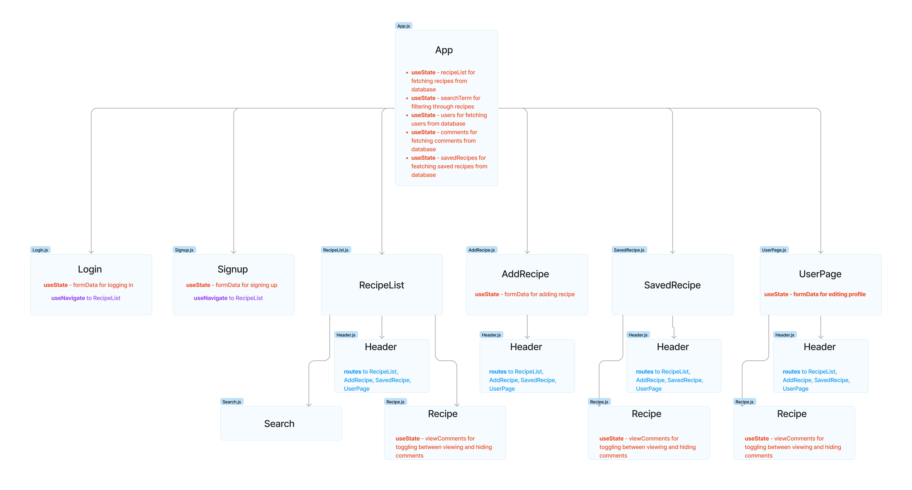
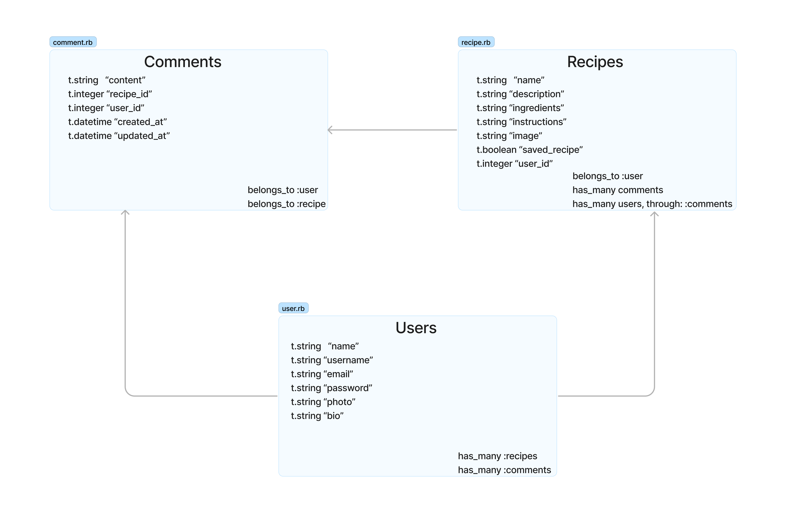
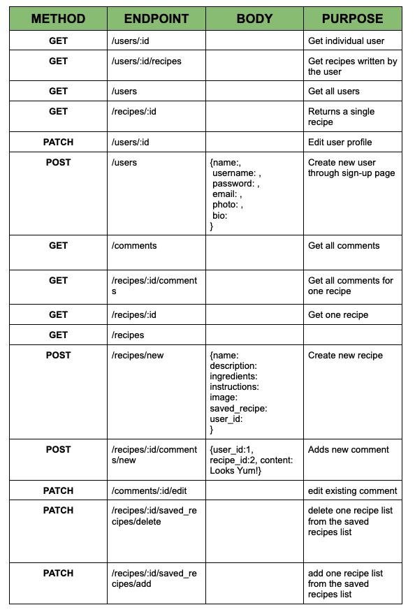

# FoodieFeed

This project was designed to practice and showcase our group's abilities in React and Ruby.  We created a social media app specific to recipes.  This is a fun app to share and discover new reciepes with other foodie enthusiasts like yourself! On this website, users will be able to:
* Create a profile
* Post new recipes
* Delete recipes
* Save recipes they like to a separate page
* Write, delete, and edit comments
* Edit their user profile

## How the App Works

When users first go to the website, they reach a login page, which also links to a signup page if they do not already have an account.  Upon successful login or signup, they are redirected to the main page RecipeList.js.  All components (```RecipeList.js, AddRecipe.js, UserPage.js```) except ```Login.js``` and ```Signup.js``` have ```Header.js``` as a child to navigate through the app's different pages.

### ```Login.js```

This component includes a form to enter the user's username and password.  When the form is submitted, the username and password are compared to the users localhost:9292/users database.  If a match is found, the user is redirected to the homepage.

### ```Signup.js```

This component includes a form with all of the signup fields, including name, username, email, password, profile picture, and bio.  When the form is submitted, the username compared to the usernames localhost:9292/users database.  If the username is already taken, users are prompted to enter a new one.  Once a successful signup form is submitted, the user is redirected to the homepage.

### ```RecipePage.js```

This component act's as the app's homepage.  All recipes posted by all users are displayed here.  Each recipe includes functionality to view comments(made by all users), write their own, delete their own, and save the recipe (which will then show up in ```SavedRecipe.js```).  When the recipe is clicked, details for that specific recipe, like ingredients and instructions, are displayed.  This is generated by ```Recipe.js```.
### ```SavedRecipe.js```

This component includes all of the recipes that a user has saved.  This componenet also allows users to remove a recipe from their saved recipes list.  When the recipe is clicked, ```Recipe.js``` generates a the details.

### ```UserPage.js```

This component shows the profile of the user signed in.  At the top of the page, the user's profile picture, name, username, and bio are displayed.  Below the user information, there is a button which allows users to edit specific things about their account (profile picture and bio).  Finally, ```Recipe.js``` is used to generate the recipe cards for the recipes created by that specific user.

### ```Recipe.js```

This component is a child of ```RecipePage.js, SavedRecipe.js, and UserPage.js```.  It displays the recipe's name, photo, and functionality to view/write comments, save, and delete the recipe.  When the card is clicked, the details are shown.  Clicking it toggles it back to the original and hides the details.

### ```AddRecipe.js```

This component contains a form to add a new recipe.  Users are prompted to fill out all of the fields.  When the form is submitted, the database stores the signed-in user as the recipe's creator.  This recipe will then appear on their ```UserPage.js```, as well as the main ```RecipePage.js```.

### ```Header.js```

This component is a child of ```RecipePage.js, SavedRecipe.js, and UserPage.js```.  This contains routes to the different pages of the website.  It is not available to ```Login.js``` and ```Signup.js``` because users must be loggin in to access the app's features.

## Technologies

### Frontend

Using React, FoodieFeed is a multi-page single-page application.  App.js is our main parent component.

React Component Tree:



To create a multi-page feel, we implemented routing in React.  Redirections were done with the ```useNavigate``` hook.

Styling was done with React-Bootstrap.

### Backend

Our backend was created with Ruby.  To make our associations, we used ActiveRecord.  

Associations Diagram:



To set up our database, we used Sinatra.

API Endpoints:



## How To Use

To use our app, first go into the frontend directory.  Then, run ```npm install```.  Finally, in another terminal, run ```npm start```.

```
npm install
npm start
```

To set up the backend, navigate to the backend directory.  From there you can run ```rake server```.

```
rake server
```